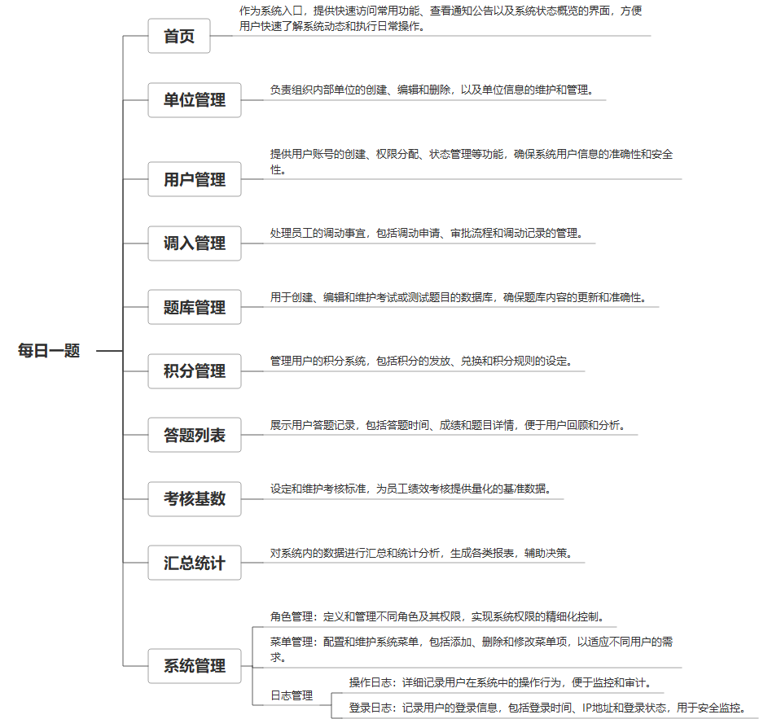

 

    
 

公司拥有上百套具有自主知识产权的软件系统，详情请查看码云首页或公司官网

 
<h1>每日一题</h1>

<a href="https://www.haishi.net.cn/">公司官网</a> ｜ <a href="https://www.haishi.net.cn/">在线体验</a>

 

## 系统介绍

党委的每日一题工作，提供题库进行每日考核，记录考核结果，并做数据分析
党委的每日一题工作，提供题库进行每日考核，记录考核结果，并做数据分析
本项目名称为每日一题管理平台，是一个用于管理每日一题的在线平台。该平台涵盖了从题库管理、用户管理、答题记录到积分统计等一系列功能，旨在提供便捷的每日一题学习和管理服务。该系统主要面向单位内部使用，管理员可以通过系统进行题库管理、用户管理、积分管理等操作，用户则可以通过平台进行答题、查看积分等。
                

## 系统功能介绍

### 系统包含终端说明

管理端（WEB）、用户端（H5）

| 序号 | 模块 | 模块说明 |
| --- | --- | --- |
| 1 | ZF-EXAM-MRYT-H5 | H5端 |
| 2 | ZF-EXAM-MRYT-MANAGE | 管理端 |
| 3 | ZF-EXAM-MRYT-SERVER | 服务端 |

### 系统功能结构

### 系统功能说明

系统终端：
- Web端：用户和管理员都通过Web端进行操作。
系统功能：
- 登录系统：用户登录平台。
- 首页：平台首页，展示一些概要信息。
- 单位管理：管理不同单位的信息。
- 用户管理：管理平台用户，包括添加、删除、修改用户信息等。
- 调入管理：（功能不明确，根据上下文推测可能与用户调动或数据导入有关）
- 题库管理：管理题库，包括添加、删除、修改题目等。
- 积分管理：管理用户的积分，包括积分规则设置、积分调整等。
- 答题列表：查看用户的答题记录。
- 考核基数：设置考核的基数。
- 汇总统计：对答题情况进行汇总统计，例如答题率、正确率等。
- 系统管理：系统设置，包括角色管理、菜单管理、日志管理等。
- 角色管理：管理系统角色权限。
- 菜单管理：管理系统菜单。
- 日志管理：查看系统日志。
主要功能：
- 题库管理：支持题目的增删改查，是每日一题的基础。
- 用户管理：管理用户账号，分配不同角色和权限。
- 答题列表和汇总统计：记录用户答题情况，并提供统计分析，方便管理员了解学习情况。
- 积分管理：激励用户参与答题，提高学习积极性。

## 系统主要界面

## 系统技术说明

### 代码模块说明

| 序号 | 目录 | 目录说明 |
| --- | --- | --- |
| 1 | ZF-EXAM-MRYT-SERVER/framework | -- |
| 2 | ZF-EXAM-MRYT-SERVER/admin | -- |
| 3 | ZF-EXAM-MRYT-SERVER/system | -- |
| 4 | ZF-EXAM-MRYT-SERVER/common | -- |
| 5 | ZF-EXAM-MRYT-SERVER/.idea | -- |

### 系统技术选型

#### 开发语言/框架

JAVA（JDK1.8）
前端框架：VUE2
前端框架：uni-app

#### 服务中间件

Nginx
Tomcat

#### 数据库

MySQL（5.7+）

#### 其他说明

无

## 系统演示/商用

请扫码添加客服微信获取演示地址和系统详细资料。

如果您想基于每日一题进行商业化交付或定制开发服务，我们提供有偿的技术服务支持，合作模式不限，欢迎沟通！

公司官网地址： <a href="https://www.haishi.net.cn/">https://www.haishi.net.cn</a>

联系客服获取专业回答。

## 使用须知

1、 本项目商用必须获得版权所有者的授权。

2、 未经允许本项目代码不允许二次出售。

